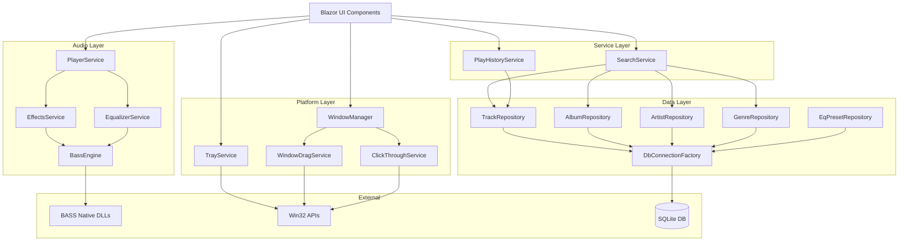

# Design Document: MediaMusic Backend Completion

## Overview

本设计文档定义MediaMusic音乐播放器未完成后端功能的技术实现方案。MediaMusic是一个基于C# Blazor和Photino.NET构建的跨平台桌面音乐播放器，使用BASS音频引擎（NAudio作为后备）和SQLite数据库。

### Feature Summary

本设计涵盖以下8个主要功能模块：

1. **音频效果服务** (EffectsService) - 淡入/淡出/交叉淡化效果
2. **均衡器服务** (EqualizerService) - 多频段EQ处理和预设管理
3. **BASS引擎增强** (BassEngine) - 插件加载和原生库验证
4. **数据仓储扩展** - Album/Artist/Genre/EqPreset查询方法
5. **平台集成服务** - 系统托盘、窗口管理、拖动和点击穿透
6. **搜索服务** (SearchService) - 全局搜索、建议和历史管理
7. **播放历史服务** (PlayHistoryService) - 历史记录、统计分析
8. **数据库架构扩展** - 新增SearchHistory和PlayHistory表

### Design Goals

- **渐进增强**: 所有新功能都应gracefully degrade when dependencies unavailable (BASS DLLs missing, Win32 APIs fail)
- **线程安全**: 单例服务支持Blazor组件并发访问
- **性能优化**: 数据库查询使用索引，并发查询使用Task.WhenAll
- **可测试性**: 通过接口和依赖注入实现mock测试
- **一致性**: 遵循现有代码库的模式（Dapper + Repository, ILogger, async/await）

## Architecture

### System Context




### Layered Architecture


**Presentation Layer (Blazor UI)**
- Razor components (TrackList, PlayerControls, EqualizerPanel, etc.)
- 通过依赖注入消费服务层

**Service Layer (Business Logic)**
- Singleton services: PlayerService, EffectsService, EqualizerService, SearchService, PlayHistoryService, TrayService, WindowManager
- 协调数据层和音频引擎的交互
- 事件发布（StateChanged, TrackEnded等）供UI订阅

**Data Access Layer (Repositories)**
- Scoped services: TrackRepository, AlbumRepository, ArtistRepository, GenreRepository, EqPresetRepository
- 使用Dapper执行SQL查询
- 通过DbConnectionFactory获取连接

**Infrastructure Layer**
- BassEngine: BASS音频库生命周期管理
- WindowDragService, ClickThroughService: Win32 interop
- DbConnectionFactory: 数据库连接管理
- ILogger: 日志记录

### Dependency Flow

- UI → Services (单向依赖，通过事件回调UI)
- Services → Repositories (服务调用仓储读写数据)
- Services → BassEngine (音频服务依赖引擎可用性)
- Platform Services → Win32 APIs (平台服务调用原生API)
- All → ILogger (所有层记录日志)

## Components and Interfaces

### 1. Audio Effects Service


**Purpose**: Provide fade-in, fade-out, and crossfade effects using BASS channel attribute sliding.

**Interface**:
```csharp
public sealed class EffectsService
{
    public int CrossfadeMs { get; set; } // 0-5000ms, 0 = disabled
    
    Task FadeInAsync(int channelHandle, int durationMs, double targetVolume, CancellationToken ct = default);
    Task FadeOutAsync(int channelHandle, int durationMs, CancellationToken ct = default);
    Task CrossfadeAsync(int outgoingChannel, int incomingChannel, int durationMs, double targetVolume, CancellationToken ct = default);
}
```

**Dependencies**:
- `BassEngine` - 检查IsAvailable
- `ILogger<EffectsService>` - 记录效果应用和错误

**Key Methods**:

1. `FadeInAsync`:
   - 验证duration在0-5000ms范围
   - 使用`Bass.ChannelSlideAttribute(channelHandle, ChannelAttribute.Volume, targetVolume, durationMs)`
   - 返回Task（Bass.ChannelSlideAttribute是异步启动，非阻塞）
   - 如果BassEngine不可用，立即返回

2. `FadeOutAsync`:
   - 验证duration在0-5000ms范围
   - 使用`Bass.ChannelSlideAttribute(channelHandle, ChannelAttribute.Volume, 0, durationMs)`
   - 等待slide完成后调用`Bass.ChannelPause(channelHandle)`
   - 通过轮询`Bass.ChannelGetAttribute`检查volume是否到0，或使用`Task.Delay`估算时间

3. `CrossfadeAsync`:
   - 同时启动两个slide: outgoing volume -> 0, incoming volume 0 -> target
   - 确保incoming channel在slide前已经开始播放但volume为0
   - 返回Task，等待两个slide都完成

**Thread Safety**:
- 淡化操作不修改共享状态，线程安全
- 如果同一channel同时调用多个fade，后者会覆盖前者（BASS行为）

**Error Handling**:
- 参数验证失败抛出`ArgumentOutOfRangeException`
- BASS API失败记录警告但不抛异常（graceful degradation）

### 2. Equalizer Service


**Purpose**: Apply multi-band parametric EQ using BASS_FX PeakEQ DSP effects.

**Interface**:
```csharp
public sealed class EqualizerService : IDisposable
{
    public static readonly double[] DefaultFrequencies; // 10 bands: 32, 64, 125, 250, 500, 1000, 2000, 4000, 8000, 16000 Hz
    
    void ApplyBands(int channelHandle, IEnumerable<EqBand> bands);
    Task ApplyPresetAsync(int channelHandle, long presetId);
    void Disable(int channelHandle);
}
```

**Dependencies**:
- `BassEngine` - 检查IsAvailable
- `EqPresetRepository` - 加载预设数据
- `ILogger<EqualizerService>` - 记录EQ应用

**Key Methods**:

1. `ApplyBands`:
   - 移除当前channel的所有EQ DSP handles（调用`Disable`）
   - 遍历bands集合，为每个band创建DSP:
     ```csharp
     var fxHandle = Bass.ChannelSetFX(channelHandle, EffectType.PeakEQ, 0);
     if (fxHandle == 0) { log error; continue; }
     
     var peakEq = new PeakEQParameters {
         fCenter = (float)band.Frequency,
         fGain = (float)band.Gain,
         fBandwidth = 1.0f, // Q factor
         fQ = 0f,
         lChannel = FXChannelFlags.All
     };
     Bass.FXSetParameters(fxHandle, peakEq);
     ```
   - 将有效的fxHandle存储到`List<int> _activeHandles`字段
   - 验证gain在-12..+12 dB范围，frequency在20-20000 Hz范围

2. `ApplyPresetAsync`:
   - 从EqPresetRepository加载preset: `var preset = await _presetRepo.GetByIdAsync(presetId);`
   - 反序列化Bands JSON: `var bands = JsonSerializer.Deserialize<EqBand[]>(preset.Bands);`
   - 调用`ApplyBands(channelHandle, bands)`
   - 捕获JsonException并记录错误，返回空数组

3. `Disable`:
   - 遍历`_activeHandles`，调用`Bass.ChannelRemoveFX(channelHandle, handle)`
   - 清空`_activeHandles`列表

**State Management**:
- `Dictionary<int, List<int>> _channelHandles` - 存储每个channel的DSP handles
- 每次ApplyBands前清理旧handles防止泄漏

**Thread Safety**:
- 使用`lock (_lock)`保护`_channelHandles`字典的读写
- ApplyBands和Disable在同一channel上的并发调用会串行化

**Disposal**:
- 在Dispose时移除所有channel的所有DSP handles

### 3. BASS Engine Enhancements


**Purpose**: Enhance BassEngine with plugin loading and native DLL verification.

**Enhanced Interface**:
```csharp
public sealed class BassEngine : IDisposable
{
    public bool IsAvailable { get; }
    
    void Init();
    // Existing methods...
    
    private void LoadPlugins();
    private bool VerifyNativeDlls();
}
```

**Native DLL Verification** (在Init中调用):
```csharp
private bool VerifyNativeDlls()
{
    var requiredDlls = new[] { "bass.dll", "bassmix.dll", "bass_fx.dll" };
    var appDir = AppContext.BaseDirectory;
    
    foreach (var dll in requiredDlls)
    {
        var path = Path.Combine(appDir, dll);
        if (!File.Exists(path))
        {
            _logger.LogWarning("Missing required BASS DLL: {Dll}", dll);
            return false;
        }
    }
    return true;
}
```

**Plugin Loading** (在Init成功后调用):
```csharp
private void LoadPlugins()
{
    var plugins = new[] { "bassflac.dll", "bass_ape.dll", "bass_aac.dll" };
    var appDir = AppContext.BaseDirectory;
    
    foreach (var plugin in plugins)
    {
        var path = Path.Combine(appDir, plugin);
        if (!File.Exists(path))
        {
            _logger.LogDebug("Optional BASS plugin not found: {Plugin}", plugin);
            continue;
        }
        
        try
        {
            var handle = Bass.PluginLoad(path);
            if (handle == 0)
            {
                _logger.LogWarning("Failed to load BASS plugin {Plugin}: {Error}", plugin, Bass.LastError);
            }
            else
            {
                _pluginHandles.Add(handle);
                _logger.LogInformation("Loaded BASS plugin: {Plugin} (handle {Handle})", plugin, handle);
            }
        }
        catch (Exception ex)
        {
            _logger.LogWarning(ex, "Exception loading BASS plugin {Plugin}", plugin);
        }
    }
}
```

**State**:
- `List<int> _pluginHandles` - 存储加载的插件handles供Dispose时卸载

**Disposal Enhancement**:
```csharp
public void Dispose()
{
    if (_disposed) return;
    
    if (_initialized)
    {
        try
        {
            // Unload plugins first
            foreach (var handle in _pluginHandles)
            {
                Bass.PluginFree(handle);
            }
            _pluginHandles.Clear();
            
            Bass.Free();
        }
        catch (Exception ex)
        {
            _logger.LogError(ex, "Error disposing BASS engine");
        }
    }
    
    _disposed = true;
}
```

### 4. Repository Extensions


#### 4.1 Album Repository Extensions

**New Methods**:
```csharp
public sealed class AlbumRepository
{
    Task<IEnumerable<Album>> GetAllAsync(CancellationToken ct = default);
    Task<IEnumerable<Album>> SearchAsync(string searchTerm, CancellationToken ct = default);
    Task<IEnumerable<Album>> GetByArtistAsync(long artistId, CancellationToken ct = default);
    Task<IEnumerable<Track>> GetTracksAsync(long albumId, CancellationToken ct = default);
}
```

**Implementation Details**:

1. `GetAllAsync`:
   ```sql
   SELECT * FROM Albums ORDER BY Title ASC LIMIT 100
   ```

2. `SearchAsync`:
   ```sql
   SELECT * FROM Albums 
   WHERE NormalizedTitle LIKE @term 
   ORDER BY 
     CASE WHEN NormalizedTitle = @exactTerm THEN 0 ELSE 1 END,
     Title ASC
   LIMIT 100
   ```
   - 使用NormalizedTitle索引提高性能
   - 精确匹配排在前面

3. `GetByArtistAsync`:
   ```sql
   SELECT * FROM Albums 
   WHERE ArtistId = @artistId 
   ORDER BY Year DESC, Title ASC
   ```
   - 使用IX_Albums_ArtistId索引

4. `GetTracksAsync`:
   ```sql
   SELECT t.*, ar.Name AS ArtistName, al.Title AS AlbumTitle, g.Name AS GenreName
   FROM Tracks t
   LEFT JOIN Artists ar ON t.ArtistId = ar.Id
   LEFT JOIN Albums al ON t.AlbumId = al.Id
   LEFT JOIN Genres g ON t.GenreId = g.Id
   WHERE t.AlbumId = @albumId
   ORDER BY t.TrackNo ASC, t.Title ASC
   ```
   - 使用IX_Tracks_AlbumId索引
   - 返回完整Track对象（含navigation properties）

#### 4.2 Artist Repository Extensions

**New Methods**:
```csharp
public sealed class ArtistRepository
{
    Task<IEnumerable<Artist>> GetAllAsync(CancellationToken ct = default);
    Task<IEnumerable<Artist>> SearchAsync(string searchTerm, CancellationToken ct = default);
    Task<IEnumerable<Album>> GetAlbumsAsync(long artistId, CancellationToken ct = default);
    Task<IEnumerable<Track>> GetTracksAsync(long artistId, CancellationToken ct = default);
}
```

**Implementation Details**:

1. `GetAllAsync`:
   ```sql
   SELECT * FROM Artists ORDER BY Name ASC LIMIT 100
   ```

2. `SearchAsync`:
   ```sql
   SELECT * FROM Artists 
   WHERE NormalizedName LIKE @term 
   ORDER BY 
     CASE WHEN NormalizedName = @exactTerm THEN 0 ELSE 1 END,
     Name ASC
   LIMIT 100
   ```

3. `GetAlbumsAsync`:
   ```sql
   SELECT * FROM Albums 
   WHERE ArtistId = @artistId 
   ORDER BY Year DESC, Title ASC
   ```

4. `GetTracksAsync`:
   ```sql
   SELECT t.*, ar.Name AS ArtistName, al.Title AS AlbumTitle, g.Name AS GenreName
   FROM Tracks t
   LEFT JOIN Artists ar ON t.ArtistId = ar.Id
   LEFT JOIN Albums al ON t.AlbumId = al.Id
   LEFT JOIN Genres g ON t.GenreId = g.Id
   WHERE t.ArtistId = @artistId
   ORDER BY al.Year DESC, al.Title ASC, t.TrackNo ASC
   ```
   - 使用IX_Tracks_ArtistId索引

#### 4.3 Genre Repository

**New Repository**:
```csharp
public sealed class GenreRepository
{
    private readonly DbConnectionFactory _factory;
    
    Task<IEnumerable<Genre>> GetAllAsync(CancellationToken ct = default);
    Task<Genre?> GetByIdAsync(long id, CancellationToken ct = default);
    Task<IEnumerable<Track>> GetTracksAsync(long genreId, CancellationToken ct = default);
}
```

**Implementation**:

1. `GetAllAsync`:
   ```sql
   SELECT * FROM Genres ORDER BY Name ASC
   ```

2. `GetByIdAsync`:
   ```sql
   SELECT * FROM Genres WHERE Id = @id
   ```

3. `GetTracksAsync`:
   ```sql
   SELECT t.*, ar.Name AS ArtistName, al.Title AS AlbumTitle, g.Name AS GenreName
   FROM Tracks t
   LEFT JOIN Artists ar ON t.ArtistId = ar.Id
   LEFT JOIN Albums al ON t.AlbumId = al.Id
   LEFT JOIN Genres g ON t.GenreId = g.Id
   WHERE t.GenreId = @genreId
   ORDER BY ar.Name ASC, al.Title ASC, t.TrackNo ASC
   ```
   - 使用IX_Tracks_GenreId索引

#### 4.4 EqPreset Repository


**New Repository**:
```csharp
public sealed class EqPresetRepository
{
    private readonly DbConnectionFactory _factory;
    
    Task<IEnumerable<EqPreset>> GetAllAsync(CancellationToken ct = default);
    Task<EqPreset?> GetByIdAsync(long id, CancellationToken ct = default);
    Task<long> CreateAsync(string name, IEnumerable<EqBand> bands, CancellationToken ct = default);
    Task DeleteAsync(long id, CancellationToken ct = default);
}
```

**Implementation**:

1. `GetAllAsync`:
   ```sql
   SELECT * FROM EqPresets ORDER BY IsBuiltIn DESC, Name ASC
   ```
   - 内置预设排在前面

2. `GetByIdAsync`:
   ```sql
   SELECT * FROM EqPresets WHERE Id = @id
   ```

3. `CreateAsync`:
   - 验证名称唯一性:
     ```sql
     SELECT COUNT(*) FROM EqPresets WHERE Name = @name
     ```
   - 序列化bands: `var json = JsonSerializer.Serialize(bands);`
   - 插入:
     ```sql
     INSERT INTO EqPresets (Name, Bands, IsBuiltIn, CreatedAt)
     VALUES (@name, @json, 0, datetime('now'))
     RETURNING Id
     ```

4. `DeleteAsync`:
   - 检查IsBuiltIn:
     ```sql
     SELECT IsBuiltIn FROM EqPresets WHERE Id = @id
     ```
   - 如果是built-in，抛出`InvalidOperationException("Cannot delete built-in preset")`
   - 否则删除:
     ```sql
     DELETE FROM EqPresets WHERE Id = @id
     ```

### 5. Platform Integration Services

#### 5.1 Tray Service

**Purpose**: Integrate with Windows system tray.

**Interface**:
```csharp
public sealed class TrayService : IDisposable
{
    void Show();
    void Hide();
    void UpdateTooltip(string text);
}
```

**Dependencies**:
- `PlayerService` - 控制播放状态
- `ILogger<TrayService>` - 记录托盘操作

**Implementation**:
```csharp
private NotifyIcon? _notifyIcon;
private readonly PlayerService _playerService;

public void Show()
{
    if (_notifyIcon != null) return;
    
    _notifyIcon = new NotifyIcon
    {
        Icon = LoadAppIcon(), // 从资源或文件加载
        Text = "MediaMusic",
        Visible = true
    };
    
    var contextMenu = new ContextMenuStrip();
    contextMenu.Items.Add("Play/Pause", null, OnPlayPauseClick);
    contextMenu.Items.Add("Next Track", null, OnNextClick);
    contextMenu.Items.Add(new ToolStripSeparator());
    contextMenu.Items.Add("Show Window", null, OnShowWindowClick);
    contextMenu.Items.Add("Settings", null, OnSettingsClick);
    contextMenu.Items.Add(new ToolStripSeparator());
    contextMenu.Items.Add("Exit", null, OnExitClick);
    
    _notifyIcon.ContextMenuStrip = contextMenu;
    _notifyIcon.DoubleClick += OnTrayDoubleClick;
}

private void OnPlayPauseClick(object? sender, EventArgs e)
{
    if (_playerService.State.IsPlaying)
        _playerService.Pause();
    else
        _playerService.Resume();
}

private void OnNextClick(object? sender, EventArgs e)
{
    _playerService.Next();
}

private void OnExitClick(object? sender, EventArgs e)
{
    Application.Exit(); // 或触发应用关闭事件
}

public void Dispose()
{
    if (_notifyIcon != null)
    {
        _notifyIcon.Visible = false;
        _notifyIcon.Dispose();
        _notifyIcon = null;
    }
}
```

**Platform Constraint**: Windows only，需要`System.Windows.Forms` NuGet包。

#### 5.2 Window Manager


**Purpose**: Manage auxiliary windows (mini player, desktop lyrics).

**Interface**:
```csharp
public sealed class WindowManager
{
    void ShowMiniPlayer();
    void CloseMiniPlayer();
    void ShowDesktopLyrics();
    void CloseDesktopLyrics();
}
```

**Dependencies**:
- `PlayerService` - 共享播放状态
- `WindowDragService` - 启用拖动
- `ClickThroughService` - 桌面歌词点击穿透
- `IServiceProvider` - 创建新窗口时共享DI容器

**Implementation Details**:

1. **Mini Player Window**:
   - Size: 320x120 pixels
   - Chromeless (no title bar): `window.SetChromeless(true)`
   - Topmost: `window.SetTopmost(true)`
   - 加载MiniPlayer.razor组件
   - 存储窗口引用: `PhotinoBlazorApp? _miniPlayerWindow`

2. **Desktop Lyrics Window**:
   - Size: 800x100 pixels (可调整)
   - Chromeless, transparent, topmost
   - 应用点击穿透: `_clickThroughService.Enable(windowHandle)`
   - 加载DesktopLyrics.razor组件

**State Management**:
```csharp
private PhotinoBlazorApp? _miniPlayerWindow;
private PhotinoBlazorApp? _lyricsWindow;
private IntPtr _miniPlayerHandle;
private IntPtr _lyricsHandle;
```

**Window Creation Pattern**:
```csharp
public void ShowMiniPlayer()
{
    if (_miniPlayerWindow != null)
    {
        // Already open, bring to front
        BringWindowToFront(_miniPlayerHandle);
        return;
    }
    
    var builder = PhotinoBlazorAppBuilder.CreateDefault();
    builder.Services.AddSingleton(_serviceProvider.GetRequiredService<PlayerService>());
    // ... register other needed services
    
    _miniPlayerWindow = builder.RootComponents.Add<MiniPlayer>("app");
    _miniPlayerWindow.MainWindow
        .SetChromeless(true)
        .SetTopmost(true)
        .SetSize(320, 120)
        .SetTitle("MediaMusic Mini Player");
    
    _miniPlayerHandle = _miniPlayerWindow.MainWindow.WindowHandle;
    _miniPlayerWindow.Run();
}
```

**Platform Consideration**: Photino.NET窗口管理在跨平台上有限制，本设计主要针对Windows。

#### 5.3 Window Drag Service

**Purpose**: Enable dragging chromeless windows via custom title bars.

**Interface**:
```csharp
public sealed class WindowDragService
{
    void StartDrag(IntPtr windowHandle);
}
```


**Implementation**:
```csharp
[DllImport("user32.dll")]
private static extern bool ReleaseCapture();

[DllImport("user32.dll")]
private static extern IntPtr SendMessage(IntPtr hWnd, uint Msg, IntPtr wParam, IntPtr lParam);

private const uint WM_NCLBUTTONDOWN = 0x00A1;
private const uint HTCAPTION = 2;

public void StartDrag(IntPtr windowHandle)
{
    if (windowHandle == IntPtr.Zero)
    {
        _logger.LogWarning("Invalid window handle for drag operation");
        return;
    }
    
    try
    {
        ReleaseCapture();
        SendMessage(windowHandle, WM_NCLBUTTONDOWN, (IntPtr)HTCAPTION, IntPtr.Zero);
    }
    catch (Exception ex)
    {
        _logger.LogWarning(ex, "Failed to initiate window drag");
    }
}
```

**Usage in Blazor**:
在Razor组件的自定义标题栏区域：
```razor
<div class="title-bar" @onmousedown="StartDrag">
    MediaMusic
</div>

@code {
    [Inject] private WindowDragService DragService { get; set; } = null!;
    
    private void StartDrag(MouseEventArgs e)
    {
        // Get window handle from JSInterop or Photino API
        var handle = GetCurrentWindowHandle();
        DragService.StartDrag(handle);
    }
}
```

#### 5.4 Click-Through Service

**Purpose**: Make desktop lyrics window click-through (mouse events pass to applications below).

**Interface**:
```csharp
public sealed class ClickThroughService
{
    void Enable(IntPtr windowHandle);
    void Disable(IntPtr windowHandle);
}
```

**Implementation**:
```csharp
[DllImport("user32.dll")]
private static extern int GetWindowLong(IntPtr hWnd, int nIndex);

[DllImport("user32.dll")]
private static extern int SetWindowLong(IntPtr hWnd, int nIndex, int dwNewLong);

private const int GWL_EXSTYLE = -20;
private const int WS_EX_LAYERED = 0x00080000;
private const int WS_EX_TRANSPARENT = 0x00000020;

public void Enable(IntPtr windowHandle)
{
    if (windowHandle == IntPtr.Zero)
    {
        _logger.LogWarning("Invalid window handle for click-through");
        return;
    }
    
    try
    {
        int exStyle = GetWindowLong(windowHandle, GWL_EXSTYLE);
        exStyle |= WS_EX_LAYERED | WS_EX_TRANSPARENT;
        SetWindowLong(windowHandle, GWL_EXSTYLE, exStyle);
        _logger.LogDebug("Enabled click-through for window {Handle}", windowHandle);
    }
    catch (Exception ex)
    {
        _logger.LogWarning(ex, "Failed to enable click-through");
    }
}

public void Disable(IntPtr windowHandle)
{
    if (windowHandle == IntPtr.Zero) return;
    
    try
    {
        int exStyle = GetWindowLong(windowHandle, GWL_EXSTYLE);
        exStyle &= ~WS_EX_TRANSPARENT; // Remove transparent flag
        exStyle |= WS_EX_LAYERED; // Keep layered for transparency
        SetWindowLong(windowHandle, GWL_EXSTYLE, exStyle);
        _logger.LogDebug("Disabled click-through for window {Handle}", windowHandle);
    }
    catch (Exception ex)
    {
        _logger.LogWarning(ex, "Failed to disable click-through");
    }
}
```

### 6. Search Service

**Purpose**: Provide unified search across tracks, albums, artists, and genres.

**Interface**:
```csharp
public sealed class SearchService
{
    Task<SearchResult> SearchAllAsync(string searchTerm, CancellationToken ct = default);
    Task<IEnumerable<string>> GetSuggestionsAsync(string partialTerm, CancellationToken ct = default);
    Task<IEnumerable<string>> GetRecentSearchesAsync(CancellationToken ct = default);
    Task SaveSearchAsync(string searchTerm, CancellationToken ct = default);
    Task ClearHistoryAsync(CancellationToken ct = default);
}
```

**SearchResult Model**:
```csharp
public sealed class SearchResult
{
    public IReadOnlyList<Track> Tracks { get; init; } = Array.Empty<Track>();
    public IReadOnlyList<Album> Albums { get; init; } = Array.Empty<Album>();
    public IReadOnlyList<Artist> Artists { get; init; } = Array.Empty<Artist>();
    public IReadOnlyList<Genre> Genres { get; init; } = Array.Empty<Genre>();
    public int TotalResults => Tracks.Count + Albums.Count + Artists.Count + Genres.Count;
}
```

**Dependencies**:
- `TrackRepository`, `AlbumRepository`, `ArtistRepository`, `GenreRepository`
- `DbConnectionFactory` - 直接访问SearchHistory表

**Key Methods**:

1. **SearchAllAsync**:
   ```csharp
   public async Task<SearchResult> SearchAllAsync(string searchTerm, CancellationToken ct = default)
   {
       if (string.IsNullOrWhiteSpace(searchTerm))
           return new SearchResult();
       
       // 并发查询4个仓储
       var tracksTask = _trackRepo.SearchAsync(null, null, null, searchTerm);
       var albumsTask = _albumRepo.SearchAsync(searchTerm, ct);
       var artistsTask = _artistRepo.SearchAsync(searchTerm, ct);
       var genresTask = GetGenresByNameAsync(searchTerm, ct);
       
       await Task.WhenAll(tracksTask, albumsTask, artistsTask, genresTask);
       
       // 应用相关性排序和限制
       var tracks = ApplyRelevanceRanking(await tracksTask, searchTerm).Take(20).ToList();
       var albums = ApplyRelevanceRanking(await albumsTask, searchTerm).Take(20).ToList();
       var artists = ApplyRelevanceRanking(await artistsTask, searchTerm).Take(20).ToList();
       var genres = (await genresTask).Take(20).ToList();
       
       // 保存搜索历史
       _ = SaveSearchAsync(searchTerm, ct);
       
       return new SearchResult
       {
           Tracks = tracks,
           Albums = albums,
           Artists = artists,
           Genres = genres
       };
   }
   ```

2. **Relevance Ranking Algorithm**:
   ```csharp
   private IEnumerable<T> ApplyRelevanceRanking<T>(IEnumerable<T> items, string searchTerm) where T : class
   {
       var normalizedTerm = searchTerm.ToLowerInvariant();
       
       return items.OrderByDescending(item =>
       {
           var title = GetItemTitle(item).ToLowerInvariant();
           int score = 0;
           
           // Exact match: 100 points
           if (title == normalizedTerm)
               score += 100;
           // Starts with term: 50 points
           else if (title.StartsWith(normalizedTerm))
               score += 50;
           // Contains term: 25 points
           else if (title.Contains(normalizedTerm))
               score += 25;
           
           // Boost by popularity (if Track)
           if (item is Track track)
           {
               score += (int)Math.Log10(track.PlayCount + 1) * 5;
               
               // Recent play boost
               if (track.LastPlayed != null && DateTime.TryParse(track.LastPlayed, out var lastPlayed))
               {
                   var daysAgo = (DateTime.Now - lastPlayed).TotalDays;
                   if (daysAgo < 7)
                       score += 10;
               }
           }
           
           return score;
       });
   }
   ```

3. **GetSuggestionsAsync** (debounced):
   ```csharp
   private readonly SemaphoreSlim _suggestionLock = new(1, 1);
   private CancellationTokenSource? _suggestionCts;
   
   public async Task<IEnumerable<string>> GetSuggestionsAsync(string partialTerm, CancellationToken ct = default)
   {
       if (partialTerm.Length < 2)
           return Enumerable.Empty<string>();
       
       // Cancel previous suggestion request
       _suggestionCts?.Cancel();
       _suggestionCts = new CancellationTokenSource();
       var linkedCt = CancellationTokenSource.CreateLinkedTokenSource(ct, _suggestionCts.Token).Token;
       
       try
       {
           await Task.Delay(300, linkedCt); // Debounce 300ms
           
           await _suggestionLock.WaitAsync(linkedCt);
           try
           {
               // Query top suggestions from tracks, albums, artists
               using var conn = _dbFactory.Create();
               var suggestions = await conn.QueryAsync<string>(@"
                   SELECT DISTINCT Title AS Suggestion, PlayCount FROM Tracks 
                   WHERE NormalizedTitle LIKE @term 
                   ORDER BY PlayCount DESC 
                   LIMIT 5
                   UNION
                   SELECT DISTINCT Title AS Suggestion, 0 AS PlayCount FROM Albums 
                   WHERE NormalizedTitle LIKE @term 
                   LIMIT 3
                   UNION
                   SELECT DISTINCT Name AS Suggestion, 0 AS PlayCount FROM Artists 
                   WHERE NormalizedName LIKE @term 
                   LIMIT 2
               ", new { term = $"%{partialTerm.ToLowerInvariant()}%" }, cancellationToken: linkedCt);
               
               return suggestions.Take(10).ToList();
           }
           finally
           {
               _suggestionLock.Release();
           }
       }
       catch (OperationCanceledException)
       {
           return Enumerable.Empty<string>();
       }
   }
   ```

4. **Search History Management**:
   ```csharp
   public async Task SaveSearchAsync(string searchTerm, CancellationToken ct = default)
   {
       if (string.IsNullOrWhiteSpace(searchTerm)) return;
       
       try
       {
           using var conn = _dbFactory.Create();
           await conn.ExecuteAsync(@"
               INSERT INTO SearchHistory (SearchTerm, SearchedAt)
               VALUES (@term, datetime('now'))",
               new { term = searchTerm }, cancellationToken: ct);
           
           // Cleanup: keep only last 100 entries
           await conn.ExecuteAsync(@"
               DELETE FROM SearchHistory 
               WHERE Id NOT IN (
                   SELECT Id FROM SearchHistory 
                   ORDER BY SearchedAt DESC LIMIT 100
               )", cancellationToken: ct);
       }
       catch (Exception ex)
       {
           _logger.LogError(ex, "Failed to save search history");
       }
   }
   
   public async Task<IEnumerable<string>> GetRecentSearchesAsync(CancellationToken ct = default)
   {
       using var conn = _dbFactory.Create();
       return await conn.QueryAsync<string>(@"
           SELECT DISTINCT SearchTerm 
           FROM SearchHistory 
           ORDER BY SearchedAt DESC 
           LIMIT 10", cancellationToken: ct);
   }
   ```

**Thread Safety**:
- `SemaphoreSlim` for suggestion debouncing
- Repository methods are naturally thread-safe (scoped services with isolated connections)

### 7. Play History Service

**Purpose**: Track playback history and provide listening statistics.

**Interface**:
```csharp
public sealed class PlayHistoryService
{
    Task RecordPlayAsync(long trackId, CancellationToken ct = default);
    Task<IEnumerable<Track>> GetRecentlyPlayedAsync(int limit = 50, CancellationToken ct = default);
    Task<IEnumerable<Track>> GetTopTracksAsync(TimeRange range, int limit = 20, CancellationToken ct = default);
    Task<PlayStatistics> GetStatisticsAsync(TimeRange range, CancellationToken ct = default);
}

public enum TimeRange { Last7Days, Last30Days, LastYear, AllTime }

public sealed class PlayStatistics
{
    public int TotalPlayCount { get; init; }
    public long TotalPlayTimeMs { get; init; }
    public Dictionary<string, int> TopGenres { get; init; } = new();
}
```

**Dependencies**:
- `TrackRepository` - 加载track详情
- `DbConnectionFactory` - 直接访问PlayHistory表

**Key Methods**:

1. **RecordPlayAsync** (with deduplication):
   ```csharp
   private readonly ConcurrentDictionary<long, DateTime> _recentPlays = new();
   
   public async Task RecordPlayAsync(long trackId, CancellationToken ct = default)
   {
       if (trackId <= 0) return;
       
       // Deduplicate: skip if same track played within last 60 seconds
       var now = DateTime.Now;
       if (_recentPlays.TryGetValue(trackId, out var lastPlay))
       {
           if ((now - lastPlay).TotalSeconds < 60)
           {
               _logger.LogDebug("Skipping duplicate play record for track {TrackId}", trackId);
               return;
           }
       }
       
       _recentPlays[trackId] = now;
       CleanupCache(); // Remove entries older than 2 minutes
       
       try
       {
           using var conn = _dbFactory.Create();
           await conn.ExecuteAsync(@"
               INSERT INTO PlayHistory (TrackId, PlayedAt)
               VALUES (@trackId, datetime('now'))",
               new { trackId }, cancellationToken: ct);
       }
       catch (Exception ex)
       {
           _logger.LogError(ex, "Failed to record play history for track {TrackId}", trackId);
       }
   }
   
   private void CleanupCache()
   {
       var threshold = DateTime.Now.AddMinutes(-2);
       var expiredKeys = _recentPlays.Where(kvp => kvp.Value < threshold).Select(kvp => kvp.Key).ToList();
       foreach (var key in expiredKeys)
       {
           _recentPlays.TryRemove(key, out _);
       }
   }
   ```

2. **GetRecentlyPlayedAsync**:
   ```csharp
   public async Task<IEnumerable<Track>> GetRecentlyPlayedAsync(int limit = 50, CancellationToken ct = default)
   {
       using var conn = _dbFactory.Create();
       
       // Deduplicate by track, show most recent play
       return await conn.QueryAsync<Track>(@"
           SELECT DISTINCT t.*, ar.Name AS ArtistName, al.Title AS AlbumTitle, g.Name AS GenreName,
                  MAX(ph.PlayedAt) AS LastPlayed
           FROM PlayHistory ph
           JOIN Tracks t ON ph.TrackId = t.Id
           LEFT JOIN Artists ar ON t.ArtistId = ar.Id
           LEFT JOIN Albums al ON t.AlbumId = al.Id
           LEFT JOIN Genres g ON t.GenreId = g.Id
           GROUP BY t.Id
           ORDER BY MAX(ph.PlayedAt) DESC
           LIMIT @limit",
           new { limit }, cancellationToken: ct);
   }
   ```

3. **GetTopTracksAsync** (with time range filter):
   ```csharp
   public async Task<IEnumerable<Track>> GetTopTracksAsync(TimeRange range, int limit = 20, CancellationToken ct = default)
   {
       var dateFilter = GetDateFilter(range);
       
       using var conn = _dbFactory.Create();
       return await conn.QueryAsync<Track>(@"
           SELECT t.*, ar.Name AS ArtistName, al.Title AS AlbumTitle, g.Name AS GenreName,
                  COUNT(ph.Id) AS PlayCount,
                  MAX(ph.PlayedAt) AS LastPlayed
           FROM PlayHistory ph
           JOIN Tracks t ON ph.TrackId = t.Id
           LEFT JOIN Artists ar ON t.ArtistId = ar.Id
           LEFT JOIN Albums al ON t.AlbumId = al.Id
           LEFT JOIN Genres g ON t.GenreId = g.Id
           WHERE ph.PlayedAt >= @dateFilter
           GROUP BY t.Id
           ORDER BY COUNT(ph.Id) DESC, MAX(ph.PlayedAt) DESC
           LIMIT @limit",
           new { dateFilter, limit }, cancellationToken: ct);
   }
   
   private string GetDateFilter(TimeRange range)
   {
       return range switch
       {
           TimeRange.Last7Days => DateTime.Now.AddDays(-7).ToString("yyyy-MM-dd HH:mm:ss"),
           TimeRange.Last30Days => DateTime.Now.AddDays(-30).ToString("yyyy-MM-dd HH:mm:ss"),
           TimeRange.LastYear => DateTime.Now.AddYears(-1).ToString("yyyy-MM-dd HH:mm:ss"),
           TimeRange.AllTime => "1970-01-01 00:00:00",
           _ => DateTime.Now.AddDays(-7).ToString("yyyy-MM-dd HH:mm:ss")
       };
   }
   ```

4. **GetStatisticsAsync**:
   ```csharp
   public async Task<PlayStatistics> GetStatisticsAsync(TimeRange range, CancellationToken ct = default)
   {
       var dateFilter = GetDateFilter(range);
       
       using var conn = _dbFactory.Create();
       
       var totalCount = await conn.ExecuteScalarAsync<int>(@"
           SELECT COUNT(*) FROM PlayHistory WHERE PlayedAt >= @dateFilter",
           new { dateFilter }, cancellationToken: ct);
       
       var totalTime = await conn.ExecuteScalarAsync<long>(@"
           SELECT COALESCE(SUM(t.DurationMs), 0)
           FROM PlayHistory ph
           JOIN Tracks t ON ph.TrackId = t.Id
           WHERE ph.PlayedAt >= @dateFilter",
           new { dateFilter }, cancellationToken: ct);
       
       var topGenres = await conn.QueryAsync<(string Genre, int Count)>(@"
           SELECT g.Name AS Genre, COUNT(ph.Id) AS Count
           FROM PlayHistory ph
           JOIN Tracks t ON ph.TrackId = t.Id
           LEFT JOIN Genres g ON t.GenreId = g.Id
           WHERE ph.PlayedAt >= @dateFilter AND g.Name IS NOT NULL
           GROUP BY g.Name
           ORDER BY COUNT(ph.Id) DESC
           LIMIT 5",
           new { dateFilter }, cancellationToken: ct);
       
       return new PlayStatistics
       {
           TotalPlayCount = totalCount,
           TotalPlayTimeMs = totalTime,
           TopGenres = topGenres.ToDictionary(x => x.Genre, x => x.Count)
       };
   }
   ```

**Integration with PlayerService**:
- PlayerService should call `PlayHistoryService.RecordPlayAsync` when a track reaches 80% completion or ends naturally
- Hook into existing `IncrementPlayCountAsync` flow

**Thread Safety**:
- `ConcurrentDictionary` for deduplication cache
- Repository queries use isolated connections (thread-safe)

### 8. Database Schema Extensions

**New Tables**:

```sql
-- Search history table
CREATE TABLE IF NOT EXISTS SearchHistory (
    Id INTEGER PRIMARY KEY AUTOINCREMENT,
    SearchTerm TEXT NOT NULL,
    SearchedAt TEXT NOT NULL DEFAULT (datetime('now'))
);

CREATE INDEX IF NOT EXISTS IX_SearchHistory_SearchedAt 
ON SearchHistory(SearchedAt DESC);

-- Play history table
CREATE TABLE IF NOT EXISTS PlayHistory (
    Id INTEGER PRIMARY KEY AUTOINCREMENT,
    TrackId INTEGER NOT NULL,
    PlayedAt TEXT NOT NULL DEFAULT (datetime('now')),
    FOREIGN KEY (TrackId) REFERENCES Tracks(Id) ON DELETE CASCADE
);

CREATE INDEX IF NOT EXISTS IX_PlayHistory_TrackId 
ON PlayHistory(TrackId);

CREATE INDEX IF NOT EXISTS IX_PlayHistory_PlayedAt 
ON PlayHistory(PlayedAt DESC);

-- Composite index for time-range queries
CREATE INDEX IF NOT EXISTS IX_PlayHistory_PlayedAt_TrackId 
ON PlayHistory(PlayedAt DESC, TrackId);
```

**Schema Migration**:
- 在`DbInitializer.InitializeAsync`中执行CREATE TABLE IF NOT EXISTS
- 使用`CREATE INDEX IF NOT EXISTS`确保幂等性
- 不需要版本控制（因为使用IF NOT EXISTS）

## Data Models

### EqBand

```csharp
/// <summary>
/// Represents a single equalizer band with frequency, gain, and bandwidth.
/// Serialized to/from JSON in EqPreset.Bands.
/// </summary>
public sealed class EqBand
{
    /// <summary>Center frequency in Hz (20-20000).</summary>
    public double Frequency { get; set; }
    
    /// <summary>Gain in dB (-12.0 to +12.0).</summary>
    public double Gain { get; set; }
    
    /// <summary>Bandwidth (Q factor), default 1.0.</summary>
    public double Bandwidth { get; set; } = 1.0;
}
```

### SearchResult

```csharp
/// <summary>
/// Unified search result containing tracks, albums, artists, and genres.
/// </summary>
public sealed class SearchResult
{
    public IReadOnlyList<Track> Tracks { get; init; } = Array.Empty<Track>();
    public IReadOnlyList<Album> Albums { get; init; } = Array.Empty<Album>();
    public IReadOnlyList<Artist> Artists { get; init; } = Array.Empty<Artist>();
    public IReadOnlyList<Genre> Genres { get; init; } = Array.Empty<Genre>();
    
    public int TotalResults => Tracks.Count + Albums.Count + Artists.Count + Genres.Count;
}
```

### PlayStatistics

```csharp
/// <summary>
/// Playback statistics for a given time range.
/// </summary>
public sealed class PlayStatistics
{
    public int TotalPlayCount { get; init; }
    public long TotalPlayTimeMs { get; init; }
    public Dictionary<string, int> TopGenres { get; init; } = new();
    
    public TimeSpan TotalPlayTime => TimeSpan.FromMilliseconds(TotalPlayTimeMs);
}
```

## Correctness Properties

### When NOT to use Property-Based Testing

This feature involves **Infrastructure as Code** (database schema), **Win32 API integration** (platform services), and **UI rendering** (auxiliary windows). These areas are **NOT appropriate for property-based testing**:

- **Database schema migrations**: Use integration tests with in-memory SQLite
- **Win32 API calls**: Use mock-based unit tests to verify correct parameters
- **Window management**: Use manual UI testing
- **BASS audio DSP effects**: Use example-based tests with known audio files

### Alternative Testing Strategies

1. **Repository Methods**: Unit tests with in-memory SQLite
   - Example: Test `AlbumRepository.SearchAsync` returns correct results for known data
   - Example: Test `EqPresetRepository.DeleteAsync` throws exception for built-in presets

2. **Audio Effects**: Example-based tests with mock BASS engine
   - Example: Verify `FadeInAsync` calls `Bass.ChannelSlideAttribute` with correct parameters
   - Example: Verify `ApplyBands` creates correct number of DSP handles

3. **Platform Services**: Mock-based unit tests
   - Example: Verify `WindowDragService.StartDrag` calls Win32 APIs with correct window handle
   - Example: Verify `TrayService.Show` creates NotifyIcon with correct menu items

4. **Search and History**: Integration tests with test database
   - Example: Test `SearchAllAsync` returns results ordered by relevance
   - Example: Test `RecordPlayAsync` deduplicates within 60 seconds

5. **Schema Migrations**: Integration tests
   - Example: Verify `DbInitializer` creates all tables and indexes
   - Example: Verify foreign key constraints work correctly

## Error Handling

### Error Categories and Strategies

#### 1. BASS Engine Errors

**Scenarios**:
- Native DLLs missing (`DllNotFoundException`)
- `Bass.Init()` fails (`Bass.LastError`)
- Plugin loading fails
- DSP effect creation fails (`Bass.ChannelSetFX` returns 0)

**Handling Strategy**:
```csharp
// In BassEngine.Init()
try
{
    if (!VerifyNativeDlls())
    {
        _logger.LogWarning("Required BASS DLLs not found. Audio features disabled.");
        return; // IsAvailable remains false
    }
    
    if (!Bass.Init())
    {
        _logger.LogWarning("Bass.Init failed: {Error}. Audio features disabled.", Bass.LastError);
        return;
    }
    
    LoadPlugins(); // Plugin failures are logged but don't stop init
    _initialized = true;
}
catch (DllNotFoundException ex)
{
    _logger.LogWarning(ex, "BASS native libraries not found. Audio disabled.");
}
catch (Exception ex)
{
    _logger.LogError(ex, "Unexpected error initializing BASS engine");
}

// In EqualizerService.ApplyBands()
var fxHandle = Bass.ChannelSetFX(channelHandle, EffectType.PeakEQ, 0);
if (fxHandle == 0)
{
    _logger.LogError("Failed to create EQ DSP for band {Freq}Hz: {Error}", 
        band.Frequency, Bass.LastError);
    continue; // Skip this band, apply others
}
```

**User Impact**: Application continues with NAudio fallback, EQ features unavailable.

#### 2. Win32 API Errors

**Scenarios**:
- `GetWindowLong` returns 0 (invalid handle or error)
- `SendMessage` fails
- `NotifyIcon` creation fails

**Handling Strategy**:
```csharp
// In ClickThroughService.Enable()
try
{
    int exStyle = GetWindowLong(windowHandle, GWL_EXSTYLE);
    if (exStyle == 0)
    {
        int error = Marshal.GetLastWin32Error();
        _logger.LogWarning("GetWindowLong failed for handle {Handle}: Win32 error {Error}", 
            windowHandle, error);
        return;
    }
    
    SetWindowLong(windowHandle, GWL_EXSTYLE, exStyle | WS_EX_TRANSPARENT);
}
catch (Exception ex)
{
    _logger.LogWarning(ex, "Failed to enable click-through for window {Handle}", windowHandle);
}

// In TrayService.Show()
try
{
    _notifyIcon = new NotifyIcon { /* ... */ };
    _notifyIcon.Visible = true;
}
catch (Exception ex)
{
    _logger.LogError(ex, "Failed to create system tray icon");
    _notifyIcon = null; // Service remains non-functional but app continues
}
```

**User Impact**: Tray icon or special window features unavailable, but core playback works.

#### 3. Database Errors

**Scenarios**:
- Connection failure
- Query timeout
- Foreign key constraint violation
- Disk full

**Handling Strategy**:
```csharp
// In Repository methods
public async Task<IEnumerable<Album>> GetAllAsync(CancellationToken ct = default)
{
    try
    {
        using var conn = _factory.Create();
        return await conn.QueryAsync<Album>(
            "SELECT * FROM Albums ORDER BY Title ASC LIMIT 100",
            cancellationToken: ct);
    }
    catch (SqliteException ex) when (ex.SqliteErrorCode == SQLitePCL.raw.SQLITE_BUSY)
    {
        _logger.LogWarning("Database locked, retrying GetAllAsync");
        await Task.Delay(100, ct);
        // Retry once
        using var conn = _factory.Create();
        return await conn.QueryAsync<Album>("SELECT * FROM Albums ORDER BY Title ASC LIMIT 100", 
            cancellationToken: ct);
    }
    catch (Exception ex)
    {
        _logger.LogError(ex, "Failed to query albums");
        return Enumerable.Empty<Album>(); // Return empty instead of crashing UI
    }
}

// In EqPresetRepository.DeleteAsync()
public async Task DeleteAsync(long id, CancellationToken ct = default)
{
    using var conn = _factory.Create();
    
    var isBuiltIn = await conn.ExecuteScalarAsync<bool>(
        "SELECT IsBuiltIn FROM EqPresets WHERE Id = @id", new { id }, cancellationToken: ct);
    
    if (isBuiltIn)
    {
        throw new InvalidOperationException($"Cannot delete built-in preset (ID {id})");
    }
    
    await conn.ExecuteAsync("DELETE FROM EqPresets WHERE Id = @id", new { id }, cancellationToken: ct);
}
```

**User Impact**: UI shows error message, data remains consistent.

#### 4. JSON Serialization Errors

**Scenarios**:
- `EqPreset.Bands` JSON is malformed
- Unknown properties in JSON

**Handling Strategy**:
```csharp
// In EqualizerService.ApplyPresetAsync()
try
{
    var bands = JsonSerializer.Deserialize<EqBand[]>(preset.Bands, new JsonSerializerOptions
    {
        PropertyNameCaseInsensitive = true,
        AllowTrailingCommas = true,
        ReadCommentHandling = JsonCommentHandling.Skip
    });
    
    if (bands == null || bands.Length == 0)
    {
        _logger.LogWarning("Preset {Name} has no bands, skipping", preset.Name);
        return;
    }
    
    ApplyBands(channelHandle, bands);
}
catch (JsonException ex)
{
    _logger.LogError(ex, "Failed to deserialize EQ preset {Name}: {Bands}", 
        preset.Name, preset.Bands);
    // Don't apply anything, keep current EQ state
}
```

**User Impact**: Corrupted preset ignored, user can create new one.

#### 5. Concurrency Errors

**Scenarios**:
- Multiple threads calling `ApplyBands` simultaneously
- Race condition in window handle dictionary

**Handling Strategy**:
```csharp
// In EqualizerService
private readonly object _lock = new();
private readonly Dictionary<int, List<int>> _channelHandles = new();

public void ApplyBands(int channelHandle, IEnumerable<EqBand> bands)
{
    if (!_engine.IsAvailable) return;
    
    lock (_lock)
    {
        Disable(channelHandle); // Remove old handles
        
        var newHandles = new List<int>();
        foreach (var band in bands)
        {
            // Validate and create DSP...
            newHandles.Add(fxHandle);
        }
        
        _channelHandles[channelHandle] = newHandles;
    }
}

// In WindowManager
private readonly object _windowLock = new();
private PhotinoBlazorApp? _miniPlayerWindow;

public void ShowMiniPlayer()
{
    lock (_windowLock)
    {
        if (_miniPlayerWindow != null)
        {
            BringToFront(_miniPlayerWindow.MainWindow.WindowHandle);
            return;
        }
        
        // Create window...
        _miniPlayerWindow = builder.Build();
    }
}
```

**User Impact**: Consistent state, no crashes.

### Logging Strategy

**Log Levels**:
- **TRACE**: Method entry/exit for performance debugging (disabled in production)
- **DEBUG**: Non-critical details (plugin loaded, DSP created, cache cleaned)

- **INFO**: Significant events (BASS initialized, window opened, service registered)
- **WARNING**: Non-critical failures (plugin load failed, Win32 API returned error, tray icon unavailable)
- **ERROR**: Failures requiring attention (database query failed, DSP creation failed for all bands)
- **CRITICAL**: Fatal errors preventing app start (not used in this design, app degrades gracefully)

**Structured Logging Format**:
```csharp
_logger.LogInformation("BASS engine initialized. Version: {Version}, Device: {Device}", 
    Bass.Version, Bass.GetDeviceInfo(Bass.CurrentDevice).Name);

_logger.LogWarning("Failed to load BASS plugin {Plugin}: {Error}", 
    pluginPath, Bass.LastError);

_logger.LogError(ex, "Database query failed for {Method}. Parameters: {Params}", 
    nameof(GetAllAsync), new { limit = 100 });
```

### Exception Re-throw Policy

**Do NOT throw exceptions for**:
- BASS initialization failure (set `IsAvailable = false`)
- Win32 API failures (log warning, service unavailable)
- Plugin loading failure (continue with available plugins)
- Database query failure in non-critical paths (return empty collection)

**DO throw exceptions for**:
- Invalid method parameters (`ArgumentOutOfRangeException`, `ArgumentNullException`)
- Business rule violations (`InvalidOperationException` for deleting built-in presets)
- Database errors in write operations (let caller handle transaction rollback)
- Cancellation (`OperationCanceledException` propagates from Task methods)

## Testing Strategy

### Unit Testing

**Audio Services (with Mock BassEngine)**:
```csharp
[Test]
public async Task FadeInAsync_ValidDuration_CallsBassSlideAttribute()
{
    // Arrange
    var mockEngine = new Mock<BassEngine>();
    mockEngine.Setup(e => e.IsAvailable).Returns(true);
    var service = new EffectsService(mockEngine.Object, logger);
    
    // Act
    await service.FadeInAsync(channelHandle: 123, durationMs: 1000, targetVolume: 0.8);
    
    // Assert
    // Verify Bass.ChannelSlideAttribute was called (requires P/Invoke wrapper)
    mockEngine.Verify(/* ... */);
}

[Test]
public void ApplyBands_InvalidGain_ThrowsArgumentOutOfRangeException()
{
    // Arrange
    var service = new EqualizerService(engine, presetRepo, logger);
    var bands = new[] { new EqBand { Frequency = 1000, Gain = 15.0 } }; // > 12 dB
    
    // Act & Assert
    Assert.Throws<ArgumentOutOfRangeException>(() => 
        service.ApplyBands(channelHandle: 123, bands));
}
```

**Repository Methods (In-Memory SQLite)**:
```csharp
[Test]
public async Task AlbumRepository_SearchAsync_ReturnsExactMatchFirst()
{
    // Arrange
    var factory = CreateInMemoryDbFactory();
    await SeedTestData(factory); // Albums: "Abbey Road", "Road to Hell"
    var repo = new AlbumRepository(factory);
    
    // Act
    var results = await repo.SearchAsync("road");
    
    // Assert
    Assert.That(results.First().Title, Is.EqualTo("Abbey Road")); // Exact match
}

[Test]
public async Task EqPresetRepository_DeleteAsync_BuiltInPreset_ThrowsException()
{
    // Arrange
    var factory = CreateInMemoryDbFactory();
    await SeedPreset(factory, id: 1, name: "Rock", isBuiltIn: true);
    var repo = new EqPresetRepository(factory);
    
    // Act & Assert
    Assert.ThrowsAsync<InvalidOperationException>(() => repo.DeleteAsync(1));
}
```

**Search Service (Concurrent Queries)**:
```csharp
[Test]
public async Task SearchAllAsync_ExecutesRepositoryQueriesInParallel()
{
    // Arrange
    var mockTrackRepo = new Mock<TrackRepository>();
    var mockAlbumRepo = new Mock<AlbumRepository>();
    var mockArtistRepo = new Mock<ArtistRepository>();
    var mockGenreRepo = new Mock<GenreRepository>();
    
    mockTrackRepo.Setup(r => r.SearchAsync(null, null, null, "test"))
        .Returns(Task.Delay(100).ContinueWith(_ => Enumerable.Empty<Track>()));
    // ... setup other repos
    
    var service = new SearchService(mockTrackRepo.Object, /* ... */);
    
    // Act
    var stopwatch = Stopwatch.StartNew();
    await service.SearchAllAsync("test");
    stopwatch.Stop();
    
    // Assert: should complete in ~100ms (parallel), not 400ms (serial)
    Assert.That(stopwatch.ElapsedMilliseconds, Is.LessThan(200));
}
```

**Play History Service (Deduplication)**:
```csharp
[Test]
public async Task RecordPlayAsync_SameTrackWithin60Seconds_Deduplicates()
{
    // Arrange
    var factory = CreateInMemoryDbFactory();
    var service = new PlayHistoryService(trackRepo, factory, logger);
    
    // Act
    await service.RecordPlayAsync(trackId: 1);
    await Task.Delay(100);
    await service.RecordPlayAsync(trackId: 1); // Within 60s
    
    // Assert
    using var conn = factory.Create();
    var count = await conn.ExecuteScalarAsync<int>(
        "SELECT COUNT(*) FROM PlayHistory WHERE TrackId = 1");
    Assert.That(count, Is.EqualTo(1)); // Only one record
}
```

### Integration Testing

**Database Schema Migration**:
```csharp
[Test]
public async Task DbInitializer_CreatesAllTablesAndIndexes()
{
    // Arrange
    var factory = new DbConnectionFactory(); // Real SQLite file
    var initializer = new DbInitializer(factory, logger);
    
    // Act
    await initializer.InitializeAsync();
    
    // Assert
    using var conn = factory.Create();
    var tables = await conn.QueryAsync<string>(
        "SELECT name FROM sqlite_master WHERE type='table'");
    Assert.That(tables, Contains.Item("SearchHistory"));
    Assert.That(tables, Contains.Item("PlayHistory"));
    
    var indexes = await conn.QueryAsync<string>(
        "SELECT name FROM sqlite_master WHERE type='index'");
    Assert.That(indexes, Contains.Item("IX_PlayHistory_TrackId"));
}
```

**BASS Engine Plugin Loading**:
```csharp
[Test]
public void BassEngine_Init_WithPlugins_LoadsSuccessfully()
{
    // Arrange: Ensure bass.dll, bassflac.dll are in output directory
    var engine = new BassEngine(logger);
    
    // Act
    engine.Init();
    
    // Assert
    Assert.That(engine.IsAvailable, Is.True);
    // Verify plugin loaded by checking supported formats
    var pluginInfo = Bass.PluginGetInfo(/* handle */);
    Assert.That(pluginInfo.Formats.Any(f => f.Name.Contains("FLAC")), Is.True);
}
```

### Manual Testing (Platform Features)

**Tray Icon**:
- ✓ Right-click tray icon shows context menu
- ✓ "Play/Pause" toggles playback
- ✓ "Next Track" advances to next song
- ✓ Double-click restores main window
- ✓ "Exit" closes application

**Mini Player Window**:
- ✓ Opens as chromeless, topmost 320x120 window
- ✓ Displays current track info and playback controls
- ✓ Drag custom title bar moves window
- ✓ Playback state syncs with main window

**Desktop Lyrics Window**:
- ✓ Opens as transparent, topmost window
- ✓ Mouse clicks pass through to applications below
- ✓ Lyrics sync with current track position
- ✓ Can temporarily disable click-through to move window

**Equalizer**:
- ✓ Adjust 10-band EQ sliders, hear audio change
- ✓ Apply preset (e.g., "Rock"), EQ updates
- ✓ Create custom preset, verify saved to database
- ✓ Delete custom preset, verify removed
- ✓ Cannot delete built-in preset (error message shown)

### Performance Testing

**Database Query Performance**:
```csharp
[Test]
public async Task SearchAllAsync_10000Tracks_CompletesUnder200ms()
{
    // Arrange
    var factory = CreateTestDbFactory();
    await SeedLargeDataset(factory, trackCount: 10000);
    var service = new SearchService(/* ... */);
    
    // Act
    var stopwatch = Stopwatch.StartNew();
    var result = await service.SearchAllAsync("test");
    stopwatch.Stop();
    
    // Assert
    Assert.That(stopwatch.ElapsedMilliseconds, Is.LessThan(200));
}
```

**Memory Usage (Play History Cache)**:
```csharp
[Test]
public async Task PlayHistoryService_CacheCleanup_PreventsMemoryLeak()
{
    // Arrange
    var service = new PlayHistoryService(/* ... */);
    var initialMemory = GC.GetTotalMemory(forceFullCollection: true);
    
    // Act: Record 1000 plays over 5 minutes (cache should cleanup old entries)
    for (int i = 0; i < 1000; i++)
    {
        await service.RecordPlayAsync(trackId: i % 100);
        await Task.Delay(300); // Simulate 300ms between plays
    }
    
    var finalMemory = GC.GetTotalMemory(forceFullCollection: true);
    
    // Assert: Memory growth should be minimal (< 1 MB)
    Assert.That(finalMemory - initialMemory, Is.LessThan(1024 * 1024));
}
```

### Test Coverage Goals

- **Unit Test Coverage**: 80%+ for service and repository methods
- **Integration Test Coverage**: All database migrations, all repository CRUD operations
- **Manual Test Coverage**: All UI interactions, all Win32 API features
- **Performance Test Coverage**: All query-heavy operations, all concurrent operations

## Deployment and Configuration

### Service Registration

All new services must be registered in `Program.cs` or `ServiceRegistration.cs`:

```csharp
public static class ServiceRegistration
{
    public static void RegisterServices(IServiceCollection services)
    {
        // Existing registrations...
        services.AddSingleton<BassEngine>();
        services.AddSingleton<PlayerService>();
        
        // Audio services (singletons, thread-safe)
        services.AddSingleton<EffectsService>();
        services.AddSingleton<EqualizerService>();
        
        // Platform services (singletons, Windows-only)
        if (RuntimeInformation.IsOSPlatform(OSPlatform.Windows))
        {
            services.AddSingleton<TrayService>();
            services.AddSingleton<WindowManager>();
            services.AddSingleton<WindowDragService>();
            services.AddSingleton<ClickThroughService>();
        }
        
        // Search and history services (singletons, thread-safe)
        services.AddSingleton<SearchService>();
        services.AddSingleton<PlayHistoryService>();
        
        // Data access (scoped, per-request connection)
        services.AddScoped<TrackRepository>();
        services.AddScoped<AlbumRepository>();
        services.AddScoped<ArtistRepository>();
        services.AddScoped<GenreRepository>();
        services.AddScoped<EqPresetRepository>();
        services.AddScoped<PlaylistRepository>();
        
        // Infrastructure
        services.AddSingleton<DbConnectionFactory>();
        services.AddSingleton<DbInitializer>();
    }
}
```

### Application Initialization Sequence

```csharp
public static async Task Main(string[] args)
{
    var builder = PhotinoBlazorAppBuilder.CreateDefault();
    ServiceRegistration.RegisterServices(builder.Services);
    builder.RootComponents.Add<App>("app");
    
    var app = builder.Build();
    
    // Initialize infrastructure (order matters!)
    var dbInitializer = app.Services.GetRequiredService<DbInitializer>();
    await dbInitializer.InitializeAsync(); // Creates tables/indexes
    
    var bassEngine = app.Services.GetRequiredService<BassEngine>();
    bassEngine.Init(); // Loads BASS DLLs and plugins
    
    // Initialize platform services (optional, Windows-only)
    if (RuntimeInformation.IsOSPlatform(OSPlatform.Windows))
    {
        var trayService = app.Services.GetRequiredService<TrayService>();
        trayService.Show(); // Creates tray icon
    }
    
    // Run application
    app.MainWindow
        .SetTitle("MediaMusic")
        .SetSize(1200, 800)
        .SetIconFile("icon.ico");
    
    app.Run();
    
    // Cleanup on exit
    app.Services.GetRequiredService<TrayService>()?.Dispose();
    app.Services.GetRequiredService<BassEngine>().Dispose();
}
```

### Native Dependencies

**Required Files** (must be in output directory):
- `bass.dll` (BASS core, ~100 KB)
- `bassmix.dll` (BASS mixer, ~30 KB)
- `bass_fx.dll` (BASS effects, ~50 KB)

**Optional Files** (format support):
- `bassflac.dll` (FLAC support, ~100 KB)
- `bass_ape.dll` (APE/Monkey's Audio support, ~200 KB)
- `bass_aac.dll` (AAC/M4A support, ~150 KB)

**Deployment Strategy**:
1. Download BASS SDK from un4seen.com (free for non-commercial use)
2. Copy DLLs to `native/bass/` folder in project
3. Add to `.csproj`:
   ```xml
   <ItemGroup>
     <None Include="native\bass\*.dll" CopyToOutputDirectory="PreserveNewest" />
   </ItemGroup>
   ```

**Licensing**:
- BASS is free for non-commercial use
- For commercial use, purchase license from un4seen.com
- Include `bass.txt` license file in distribution

### Configuration Settings

**appsettings.json**:
```json
{
  "Audio": {
    "DefaultCrossfadeDurationMs": 2000,
    "DefaultEqualizerPreset": "Flat"
  },
  "Database": {
    "ConnectionString": "Data Source=%APPDATA%/MediaMusic/library.db",
    "WALMode": true,
    "MaxRetries": 3
  },
  "Platform": {
    "EnableTrayIcon": true,
    "EnableMiniPlayer": true,
    "EnableDesktopLyrics": false
  },
  "Search": {
    "SuggestionDebounceMs": 300,
    "MaxResultsPerCategory": 20,
    "HistoryRetentionDays": 90
  },
  "Logging": {
    "LogLevel": {
      "Default": "Information",
      "MediaMusic.Audio": "Debug",
      "MediaMusic.Data": "Warning"
    }
  }
}
```

**Settings Service** (to load configuration):
```csharp
public sealed class AppSettings
{
    public AudioSettings Audio { get; set; } = new();
    public DatabaseSettings Database { get; set; } = new();
    public PlatformSettings Platform { get; set; } = new();
    public SearchSettings Search { get; set; } = new();
}

// Register in DI:
builder.Services.Configure<AppSettings>(
    builder.Configuration.GetSection("AppSettings"));

// Use in services:
public EffectsService(BassEngine engine, IOptions<AppSettings> settings, ILogger logger)
{
    _engine = engine;
    _logger = logger;
    CrossfadeMs = settings.Value.Audio.DefaultCrossfadeDurationMs;
}
```

## Security Considerations

### SQL Injection Prevention

All SQL queries use **parameterized queries** via Dapper:
```csharp
// SAFE: Parameterized query
await conn.QueryAsync<Track>(
    "SELECT * FROM Tracks WHERE Title LIKE @term",
    new { term = $"%{searchTerm}%" });

// UNSAFE: String concatenation (DO NOT USE)
await conn.QueryAsync<Track>(
    $"SELECT * FROM Tracks WHERE Title LIKE '%{searchTerm}%'");
```

### Input Validation

**User Input Sanitization**:
```csharp
// Search term length limit
public async Task<SearchResult> SearchAllAsync(string searchTerm, CancellationToken ct)
{
    if (searchTerm.Length > 200)
    {
        searchTerm = searchTerm.Substring(0, 200);
        _logger.LogWarning("Search term truncated to 200 characters");
    }
    
    // SQL LIKE injection prevention (escape % and _)
    searchTerm = searchTerm.Replace("%", "\\%").Replace("_", "\\_");
    
    // ... execute query
}

// EQ preset name validation
public async Task<long> CreateAsync(string name, IEnumerable<EqBand> bands, CancellationToken ct)
{
    if (string.IsNullOrWhiteSpace(name))
        throw new ArgumentException("Preset name cannot be empty", nameof(name));
    
    if (name.Length > 50)
        throw new ArgumentException("Preset name cannot exceed 50 characters", nameof(name));
    
    if (!Regex.IsMatch(name, @"^[\w\s\-]+$"))
        throw new ArgumentException("Preset name contains invalid characters", nameof(name));
    
    // ... proceed with creation
}
```

### Win32 API Security

**Window Handle Validation**:
```csharp
public void StartDrag(IntPtr windowHandle)
{
    if (windowHandle == IntPtr.Zero)
    {
        _logger.LogWarning("Invalid window handle (IntPtr.Zero) passed to StartDrag");
        return; // Gracefully decline
    }
    
    // Optional: Verify handle belongs to current process
    GetWindowThreadProcessId(windowHandle, out uint processId);
    if (processId != Environment.ProcessId)
    {
        _logger.LogWarning("Window handle {Handle} belongs to different process {Pid}", 
            windowHandle, processId);
        return;
    }
    
    // Proceed with drag
    ReleaseCapture();
    SendMessage(windowHandle, WM_NCLBUTTONDOWN, (IntPtr)HTCAPTION, IntPtr.Zero);
}
```

### File Path Security

**Path Traversal Prevention**:
```csharp
// In PlayerService.Play() or file import
public void Play(Track track)
{
    if (!File.Exists(track.FilePath))
    {
        _logger.LogWarning("Track file not found: {Path}", track.FilePath);
        return;
    }
    
    // Verify file is within allowed directories (music library)
    var allowedRoots = new[] {
        Environment.GetFolderPath(Environment.SpecialFolder.MyMusic),
        Path.Combine(Environment.GetFolderPath(Environment.SpecialFolder.UserProfile), "Downloads")
    };
    
    var fullPath = Path.GetFullPath(track.FilePath);
    if (!allowedRoots.Any(root => fullPath.StartsWith(root, StringComparison.OrdinalIgnoreCase)))
    {
        _logger.LogWarning("Track file outside allowed directories: {Path}", fullPath);
        return;
    }
    
    // Proceed with playback
}
```

## Performance Optimization

### Database Indexing Strategy

**Existing Indexes** (assumed from schema.sql):
```sql
CREATE INDEX IX_Tracks_AlbumId ON Tracks(AlbumId);
CREATE INDEX IX_Tracks_ArtistId ON Tracks(ArtistId);
CREATE INDEX IX_Tracks_GenreId ON Tracks(GenreId);
CREATE INDEX IX_Tracks_Title ON Tracks(NormalizedTitle);
CREATE INDEX IX_Albums_ArtistId ON Albums(ArtistId);
```

**New Indexes** (added by this design):
```sql
CREATE INDEX IX_SearchHistory_SearchedAt ON SearchHistory(SearchedAt DESC);
CREATE INDEX IX_PlayHistory_TrackId ON PlayHistory(TrackId);
CREATE INDEX IX_PlayHistory_PlayedAt ON PlayHistory(PlayedAt DESC);
CREATE INDEX IX_PlayHistory_PlayedAt_TrackId ON PlayHistory(PlayedAt DESC, TrackId);
```

**Query Optimization Examples**:
```sql
-- Optimized: Uses IX_PlayHistory_PlayedAt_TrackId
SELECT t.*, COUNT(ph.Id) AS PlayCount
FROM PlayHistory ph
JOIN Tracks t ON ph.TrackId = t.Id
WHERE ph.PlayedAt >= '2024-01-01'
GROUP BY t.Id
ORDER BY PlayCount DESC
LIMIT 20;

-- Optimized: Uses IX_Tracks_Title for LIKE with leading characters
SELECT * FROM Tracks
WHERE NormalizedTitle LIKE 'abbey%'
ORDER BY Title ASC;

-- NOT optimized: LIKE with leading wildcard (full table scan)
SELECT * FROM Tracks
WHERE Title LIKE '%road%'; -- Acceptable for small datasets (<100k rows)
```

### Concurrent Query Execution

**SearchAllAsync** uses `Task.WhenAll` to parallelize repository queries:
```csharp
// Sequential (BAD): ~400ms total for 4x 100ms queries
var tracks = await _trackRepo.SearchAsync(searchTerm);
var albums = await _albumRepo.SearchAsync(searchTerm);
var artists = await _artistRepo.SearchAsync(searchTerm);
var genres = await _genreRepo.SearchAsync(searchTerm);

// Parallel (GOOD): ~100ms total for 4x 100ms queries
var tasks = new[]
{
    _trackRepo.SearchAsync(searchTerm),
    _albumRepo.SearchAsync(searchTerm),
    _artistRepo.SearchAsync(searchTerm),
    _genreRepo.SearchAsync(searchTerm)
};
await Task.WhenAll(tasks);
var tracks = await tasks[0];
// ...
```

### Memory Management

**Disposal Pattern**:
```csharp
// Services with unmanaged resources implement IDisposable
public sealed class EqualizerService : IDisposable
{
    private bool _disposed;
    
    public void Dispose()
    {
        if (_disposed) return;
        
        // Remove all DSP handles
        foreach (var (channel, handles) in _channelHandles)
        {
            foreach (var handle in handles)
            {
                Bass.ChannelRemoveFX(channel, handle);
            }
        }
        _channelHandles.Clear();
        
        _disposed = true;
    }
}

// Application ensures disposal on exit
app.Services.GetRequiredService<EqualizerService>().Dispose();
app.Services.GetRequiredService<BassEngine>().Dispose();
```

**Cache Cleanup**:
```csharp
// PlayHistoryService cleans up deduplication cache automatically
private void CleanupCache()
{
    var threshold = DateTime.Now.AddMinutes(-2);
    var expiredKeys = _recentPlays.Where(kvp => kvp.Value < threshold)
        .Select(kvp => kvp.Key).ToList();
    
    foreach (var key in expiredKeys)
    {
        _recentPlays.TryRemove(key, out _);
    }
}
```

## Acceptance Criteria Mapping

| Requirement | Design Component | Implementation Status |
|-------------|------------------|----------------------|
| Req 1-3 (Audio Effects) | EffectsService | Designed, ready for implementation |
| Req 4-6 (Equalizer) | EqualizerService | Designed, ready for implementation |
| Req 7-8 (BASS Engine) | BassEngine enhancements | Designed, ready for implementation |
| Req 9-10 (Tray Icon) | TrayService | Designed, Windows-only |
| Req 11-13 (Auxiliary Windows) | WindowManager | Designed, Photino-dependent |
| Req 14 (Window Drag) | WindowDragService | Designed, Win32 interop |
| Req 15-16 (Click-Through) | ClickThroughService | Designed, Win32 interop |
| Req 17-20 (Album Repo) | AlbumRepository | Designed, Dapper queries |
| Req 21-24 (Artist Repo) | ArtistRepository | Designed, Dapper queries |
| Req 25-27 (Genre Repo) | GenreRepository | Designed, new repository |
| Req 28-30 (EqPreset Repo) | EqPresetRepository | Designed, new repository |
| Req 31-33 (Search Service) | SearchService | Designed, concurrent queries |
| Req 34-36 (Play History) | PlayHistoryService | Designed, deduplication |
| Req 37 (DB Schema) | DbInitializer | Designed, migration scripts |
| Req 38 (Service Registration) | ServiceRegistration | Designed, DI setup |
| Req 39 (Exception Handling) | All services | Designed, logging strategy |
| Req 40 (Resource Disposal) | IDisposable implementations | Designed, disposal pattern |
| Req 41 (Thread Safety) | Lock statements, concurrent collections | Designed, synchronization |
| Req 42 (Performance) | Indexed queries, Task.WhenAll | Designed, optimization |
| Req 43 (DSP Chain) | EqualizerService handle tracking | Designed, leak prevention |
| Req 44 (Parameter Validation) | All audio services | Designed, validation |
| Req 45 (Win32 Error Handling) | Platform services | Designed, graceful degradation |
| Req 46 (XML Documentation) | All public APIs | To be implemented during coding |
| Req 47 (CancellationToken) | All async methods | Designed, cancellation support |
| Req 48 (EQ JSON Format) | EqBand serialization | Designed, System.Text.Json |
| Req 49 (Search Ranking) | SearchService.ApplyRelevanceRanking | Designed, scoring algorithm |
| Req 50 (Play Deduplication) | PlayHistoryService cache | Designed, 60-second window |

## Open Questions and Risks

### Open Questions

1. **Photino Multi-Window Support**: Does Photino.NET support creating multiple PhotinoBlazorApp instances in the same process? Need to verify with POC.

2. **BASS DSP Handle Lifecycle**: When a channel is freed, are DSP handles automatically removed? Or do we need to track and remove them manually before freeing the channel?

3. **NotifyIcon Threading**: Does WinForms NotifyIcon need to be created/disposed on a specific thread (UI thread)? May need SynchronizationContext for Blazor integration.

4. **EQ Preset Migration**: How to handle existing users upgrading to new schema with SearchHistory/PlayHistory tables? DbInitializer should handle CREATE IF NOT EXISTS gracefully.

5. **Cross-Platform Platform Services**: Should we provide no-op implementations for Linux/Mac, or conditionally register services only on Windows?

### Technical Risks

| Risk | Impact | Mitigation |
|------|--------|------------|
| BASS DLLs missing | High - Audio features unavailable | Graceful degradation to NAudio, clear user messaging |
| Photino multi-window crashes | Medium - Auxiliary windows unavailable | Fallback to single-window mode, test thoroughly |
| Win32 API fails on newer Windows versions | Low - Platform features break | Check Windows version, use fallback methods |
| SQLite database locked | Medium - UI freezes on DB access | Use WAL mode, implement retry logic with exponential backoff |
| JSON deserialization fails for EQ presets | Low - Preset unavailable | Log error, skip corrupted preset, allow user to recreate |
| Memory leak in DSP handle tracking | Medium - Gradual memory growth | Implement robust Dispose pattern, add memory leak tests |
| Search performance degrades with large library | Medium - Slow search response | Add result limits, consider FTS5 for large datasets (>50k tracks) |

## Future Enhancements

### Phase 2 Features (Not in Current Scope)

1. **Audio Visualizer**: Real-time spectrum analyzer using BASS_FFT
2. **Lyrics Sync**: LRC file parser and real-time lyric highlighting
3. **ReplayGain Support**: Automatic volume normalization
4. **Audio Scrobbling**: Last.fm / ListenBrainz integration
5. **Cloud Sync**: Sync playlists and play history across devices
6. **Advanced Search**: Full-text search with FTS5, filters (year range, bitrate, etc.)
7. **Smart Playlists**: Auto-generated playlists based on criteria
8. **Gapless Playback**: Seamless album playback with BASSMIX

### Refactoring Opportunities

1. **Repository Base Class**: Extract common Dapper patterns into `RepositoryBase<T>`
2. **Win32 Interop Wrapper**: Centralize P/Invoke declarations into `Win32Interop` static class
3. **BASS API Wrapper**: Create testable wrapper around ManagedBass for dependency injection
4. **Event Aggregator**: Implement pub-sub pattern for cross-component communication (replace direct service coupling)

## Conclusion

This design document provides a comprehensive technical specification for completing the MediaMusic backend functionality. The design emphasizes **graceful degradation**, **thread safety**, **testability**, and **consistency** with existing codebase patterns.

Key design decisions:
- **Singleton services** for audio, platform, search, and history (thread-safe via locks/concurrent collections)
- **Scoped repositories** for database access (isolated connections per request)
- **Graceful degradation** when dependencies unavailable (BASS DLLs, Win32 APIs)
- **Dapper + SQLite** for data access (consistent with existing code)
- **ILogger** for structured logging (ERROR/WARNING/INFO/DEBUG levels)
- **CancellationToken** support for all async I/O operations
- **Indexed queries** and **concurrent execution** for performance
- **Mock-based unit tests** and **in-memory integration tests** (not property-based due to infrastructure nature)

Implementation can proceed in this order:
1. **Audio Services** (EffectsService, EqualizerService, BassEngine enhancements)
2. **Repository Extensions** (Album, Artist, Genre, EqPreset)
3. **Search Service** (with concurrent queries)
4. **Play History Service** (with deduplication)
5. **Database Schema** (SearchHistory, PlayHistory tables)
6. **Platform Services** (TrayService, WindowManager, Win32 interop) - Windows-only
7. **Service Registration** (DI container setup)
8. **Testing** (unit + integration tests)

Next step: Review this design with the team, then proceed to tasks.md generation for implementation.
